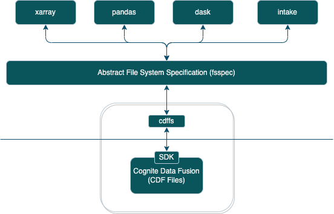

Cognite cdffs
=============

A file-system interface to allow users to work with CDF Files using the fsspec supported/compatible python packages.

`fsspec` provides an abstract file system interface to work with local/cloud storages and based on the
protocol name (example, `s3` or `abfs`) provided in the path, `fsspec` translates the incoming requests
to storage specific implementations and send the responses back to the upstream package to work with the desired data.

High level flow from various packages.

Path translation
^^^^^^^^^^^^^^^^

CDF Files has two layers, metadata layer and blob storage layer. So, every read/write request issued using different
python packages will first hit the metadata layer and the file contents will then be upload/download to/from
the underlying blob storage.

Even though users can use `cdffs` protocol and path in fsspec supported/compatible python packages similar to `abfs` or `s3`,
the path issued when the data is read/written will get translated to different metadata fields when working with CDF Files.

Example,

.. code-block:: python

    import pandas as pd
    df = pd.read_csv("cdffs://pandas/test_data.csv", storage_options={"connection_config": client_cnf})

* :code:`cdffs` - `protocol name` - ffspec will use this protocol name to decide which file system spec implementation or package to use. In this case, it will be cognite.cdffs package.

* :code:`/pandas/` - `directory prefix` - cdffs will translate the directory prefix as a root directory.

* :code:`test_data.csv` - `name` - cdffs will translate the file name as an external_id and name. When multiple part files or chunk files are expected to be generated, it will use the filename and all the subsequent child directory/file names as an external_id.

Few more examples on how the path gets translated to different metadata fields are listed below.

.. list-table:: Path translation examples.
   :header-rows: 1

   * - File Path
     - Structure
     - FileMetadata.directory
     - FileMetadata.external_id
     - FileMetadata.name
   * - :code:`cdffs://test_data/test.csv`
     - .. code-block:: bash

        test_data
        └── test.csv

        0 directories, 1 file

     - `/test_data`
     - `test.csv`
     - `test.csv`
   * - :code:`cdffs://zarr_tests/sample.zarr`
     - .. code-block:: bash

        zarr_tests
        └── sample.zarr
            ├── .zattrs
            ├── .zgroup
            ├── .zmetadata
            ├── x
            │   ├── .zarray
            │   ├── .zattrs
            │   └── 0
            └── y
                ├── .zarray
                ├── .zattrs
                └── 0

        3 directories, 9 files

     - `/zarr_tests`
     - | `sample.zarr/.zattrs`
       | `sample.zarr/.zgroup`
       | `sample.zarr/.zmetadata`
       | `sample.zarr/x/.zarray`
       | `sample.zarr/x/.zattrs`
       | `sample.zarr/x/0`
       | `sample.zarr/y/.zarray`
       | `sample.zarr/y/.zattrs`
       | `sample.zarr/y/0`

     - | `.zattrs`
       | `.zgroup`
       | `.zmetadata`
       | `.zarray`
       | `.zattrs`
       | `0`
       | `.zarray`
       | `.zattrs`
       | `0`

Caching
^^^^^^^

There are three different caching techniques are used to improve the overall performance.

* Path caching

    Metadata layer on CDF files is eventually consistent - Any read-after-write requests might yield to unexpected results for a very short time. So, In order to prevent unexpected issues when read-after-write consistency is absolutely necessary (especially when working with zarr files using xarray/zarr packages), all the external_ids (constructed from file paths) used to write the data, will be cached and cached external_ids (constructed from file paths) will be included when the file read/list requests are issued.

* Directory list caching

    Upstream packages might request a list directory multiple times within short intervals which gets translated to list endpoint in cdffs. So, In order to prevent hitting the list endpoint multiple times for the same directory/external_id prefixes, all the file paths will be cached with a specific expiry time (defaulted to 60 seconds) and cached file paths will be returned to the list requests when results are not expired.

* File contents caching

    The file contents will be read once and it will be cached using allbytes caching from fsspec to improve the read performance and also overcome the limitations on performing range queries. Users will not be able to choose thier preferred cache_type when working with CDF Files.

Additional Configurations
^^^^^^^^^^^^^^^^^^^^^^^^^
Supported configurations when working with `cdffs`.

.. list-table:: cdffs specific configurations
   :header-rows: 1

   * - Parameter name
     - Mandatory/Optional
     - Description

   * - `connection_config`
     - `Mandatory`
     - Client Config to authenticate the requests to CDF. Refer: `ClientConfig <https://cognite-sdk-python.readthedocs-hosted.com/en/latest/cognite.html#cognite.client.config.ClientConfig>`_

   * - `file_metadata`
     - `Optional` but highly recommended
     - Metadata information to add for files. Refer: `FileMetadata <https://cognite-sdk-python.readthedocs-hosted.com/en/latest/cognite.html#cognite.client.data_classes.files.FileMetadata>`_

   * - `cdf_list_expiry_time`
     - `Optional`
     - Directory list cache expiry time. Default is 60 seconds

   * - `max_download_retries`
     - `Optional`
     - Maximum number of download retries allowed before exhausting. Default is 5.

   * - `download_retries`
     - `Optional`
     - Flag to indicate enable/disable download retries. Default is True.

   * - `upload_strategy`
     - `Optional`
     - Flag to configure various file upload strategies. Possible values: [`azure`, `google`, `inmemory`]. Default is `inmemory`.
       `azure`: will use multipart upload expecting CDF in Azure. `google` will use multipart upload expecting CDF in Google.
       `inmemory` is a default upload strategy, where entire file is cached and uploaded as a single call to CDF.

